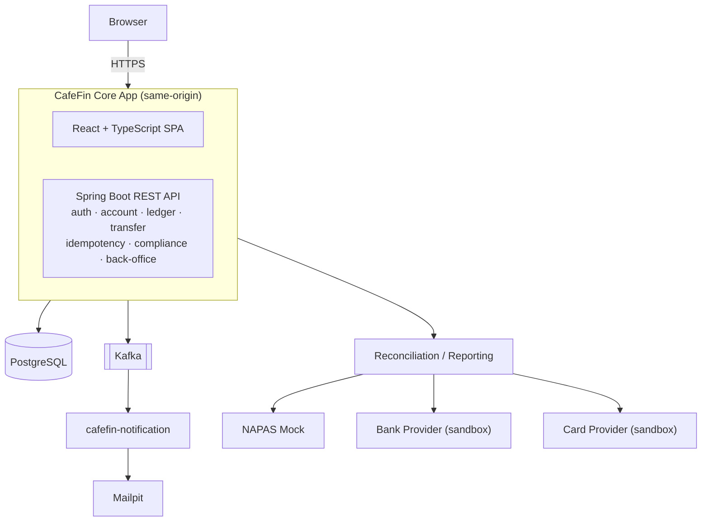

<div align="center">
  

  <p>A Java/Spring fintech platform, built as a deep-dive simulation: double-entry ledger, external payment gateway, event-driven notifications, compliance, and multi-region resilience.</p>

  <p>
    
    
    
    
    
    <a href="LICENSE"></a>
  </p>
</div>

<br>

> [!IMPORTANT]
> CafeFin is an engineering simulation, not a licensed financial service. It is not a
> production-ready payment platform, a licensed payment service or credit institution, a
> PCI-certified environment, or an approved bank-network integration. A real-money deployment
> would need a jurisdiction-specific legal entity, regulatory licensing, contracted providers,
> independent security certification, and validated operational procedures. None of that exists
> here. Details in [Production readiness](#production-readiness).

## What is this

Fintech tutorials tend to show isolated pieces: a locking strategy here, a webhook signature there.
CafeFin puts them in one running system instead. Balances are never stored directly: they're
derived from an immutable ledger. Transfers are idempotent under concurrent load. Outbound payments
run through a saga with an explicit `IN_DOUBT` state for network timeouts, because a timeout is not
the same thing as a failure. Events reach downstream services through a transactional outbox rather
than a dual write. On top of that sits KYC/AML, regulatory reporting, back-office tooling, and
multi-region failover.

Each backend capability ships with a matching frontend slice, so the system stays demonstrable
end-to-end rather than only covered by backend tests.

## Architecture



HA/DR, multi-region failover, and observability (tracing, Loki, Prometheus/Grafana) wrap around
this core rather than living in any single box.

## Repository layout

```
cafefin/                           Parent pom, packaging=pom
├── cafefin-common/                Shared DTOs, exceptions, utilities
├── cafefin-api/                   Primary Spring Boot app, serves API + React SPA
├── cafefin-napas-mock/            Mock external payment gateway
├── cafefin-notification/          Kafka notification consumer
├── frontend/cafefin-web/          React + TypeScript + Vite source
├── docs/adr/                      Architecture Decision Records
├── resources/                     Static assets (this README's logo, etc.)
├── .claude/                       Project memory: spec, plans, decision ledger
└── docker-compose.yml
```

## Tech stack

| | |
|---|---|
| **Backend** | Java 25 (LTS) · Spring Boot 4.1.1 · Maven (multi-module) |
| **Persistence** | PostgreSQL 17 · Flyway |
| **Messaging** | Kafka 4.x (KRaft mode) |
| **Frontend** | React 19 · TypeScript (strict) · Vite · TanStack Query · React Hook Form + Zod · shadcn/ui + Tailwind CSS |
| **Testing** | JUnit 5 + Testcontainers (backend) · Vitest + React Testing Library + Playwright (frontend) |
| **Observability** | Micrometer Tracing · Grafana Loki/Alloy · Prometheus + Grafana |

## Getting started

```bash
docker compose up --build
```

This brings up PostgreSQL, the backend, and the React SPA behind one origin
(`http://localhost:8080`). Demo accounts arrive already funded through real double-entry ledger
transactions, so there's no manual SQL to run.

## REST API Summary

Endpoints use JSON. Only what's actually built ships here — see
[`.claude/docs/plans/`](.claude/docs/plans/) for what's planned but not yet implemented.

### Auth Endpoints
| Method | Path | Auth | Description | Flow Guide |
|---|---|:---:|---|:---:|
| `POST` | `/api/v1/auth/register` | No | Register a new user (`email`, `password`) | [View Flow](resources/docs/REGISTER.md) |

## Documentation

- [`.claude/docs/specs/cafefin_roadmap_v4.md`](.claude/docs/specs/cafefin_roadmap_v4.md): the
  source roadmap, with requirements, ADR triggers, and verification criteria.
- [`.claude/docs/specs/requirements.md`](.claude/docs/specs/requirements.md): per-requirement
  decision status, indexed by task number.
- [`.claude/docs/specs/memory/`](.claude/docs/specs/memory/): the distilled spec, one file per
  domain area.
- [`.claude/docs/plans/`](.claude/docs/plans/): the implementation plan per area, with each task
  tied to the test that proves it.
- `docs/adr/`: Architecture Decision Records for the contested engineering trade-offs, including
  locking strategy, isolation level, idempotency boundaries, `IN_DOUBT` handling, and Kafka
  ordering versus liveness.

## Production readiness

Completing this roadmap demonstrates engineering patterns for a real fintech platform, but it does
not by itself establish regulatory compliance, licensing, PCI certification, production
bank-network approval, or operational readiness for real customer funds. A real deployment would
additionally need a jurisdiction-specific legal entity, regulatory licensing, contracted providers,
independent security assessment, and validated operational procedures. The roadmap's
"Production-Readiness Risk Assessment" section has the full breakdown.

## License

[MIT](LICENSE)
