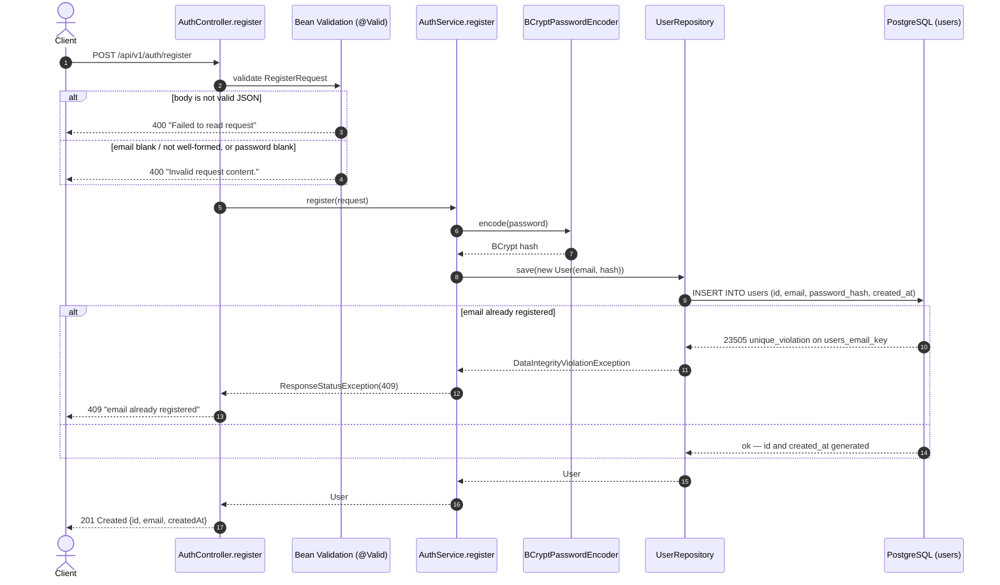

[← Back to docs index](../TUTORIAL.md)

# Flow: Register (`POST /api/v1/auth/register`)

Creates a new user account. Public endpoint — no auth required.

---

## 1. Contract

- **Method & path**: `POST /api/v1/auth/register`
- **Auth**: none
- **Rate limit**: none yet — a per-IP limit is planned but not implemented
- **Request / response**: JSON

### Request

```json
{
  "email": "learner@example.com",
  "password": "correcthorsebattery"
}
```

### Response — `201 Created`

```json
{
  "id": "0feea416-035a-439b-beac-8719d9db289c",
  "email": "learner@example.com",
  "createdAt": "2026-09-22T03:32:43.641002Z"
}
```

`id` is a random UUID, generated in the JVM by Hibernate (`GenerationType.UUID`), not read back
from the database's own `gen_random_uuid()` default — and not a sequential `1, 2, 3, ...` id, on
purpose: a sequential id would let anyone who sees one user's id guess roughly how many users exist
and how fast that number is growing. The password hash is never returned — `RegisterResponse`
simply has no field for it (§ 3, step 7 has the full reasoning).

---

## 2. Sequence



---

## 3. Step by step

1. **Deserialize + validate.** `@Valid @RequestBody RegisterRequest` — `email` must be non-blank and
   a well-formed address (`@Email`), `password` must be non-blank (`@NotBlank`). This is *declarative*
   validation: the annotations describe the rule, and Spring runs the check before
   `AuthController.register`'s body executes at all — the method never sees an invalid `email` or
   `password`, so it doesn't need an `if` for either. Malformed JSON and failed validation both
   surface as Spring's default `400` `ProblemDetail`, not a custom error shape — see § 4 for the
   exact bodies.
2. **No email normalization.** Unlike a case-insensitive lookup, the `email` column's `UNIQUE`
   constraint is case-sensitive as stored — `A@x.com` and `a@x.com` are two different rows today.
   No lower-casing/trimming happens in `RegisterRequest` or `AuthService`.
3. **No password policy beyond non-blank.** The spec states none, so none is enforced —
   deliberately not inventing a length/complexity rule that isn't actually decided anywhere.
4. **Hash the password.** `BCryptPasswordEncoder` (default strength, cost 10) turns the plaintext
   into a hash. This is the one step worth understanding deeply if you're new to auth: bcrypt is a
   **one-way** function — there is no `decode()`. Nothing in this codebase, not even an admin, can
   ever recover the original password from what's stored in `password_hash`. That's also why a
   future login endpoint can only *compare* (`passwordEncoder.matches(rawPassword, storedHash)` —
   re-hash the login attempt and check it matches), never "look up and decrypt" the password. bcrypt
   also generates its own random salt and embeds it inside the hash string it returns, so there's no
   separate salt column to manage.
5. **No pre-check for duplicates.** `AuthService.register` goes straight to `save()` and lets the
   `users.email` `UNIQUE` constraint (`V2__users.sql`) do the work, instead of querying "does this
   email exist?" first. That query-then-insert shape has a real bug hiding in it: two requests for
   the same brand-new email can both run the "does it exist?" check *before* either one has
   inserted anything, both see "no", and both proceed to insert — the check and the insert aren't
   one atomic operation. A database constraint is checked by the database itself at insert time, so
   it's the only thing here that can't be raced.
6. **Catch and translate.** A `DataIntegrityViolationException` from that constraint is caught and
   rethrown as `ResponseStatusException(HttpStatus.CONFLICT, "email already registered")`. Spring's
   `problemdetails` support (`spring.mvc.problemdetails.enabled: true`) renders it as RFC 9457
   automatically — no custom exception type or `@ControllerAdvice`. The reason this project uses a
   structured error format at all, rather than a plain string: the caller of a fintech API is
   usually code (a frontend, or another backend service), not a human reading a screen — it needs a
   `status`/`detail` it can branch on programmatically, not prose to parse.
7. **Respond with a DTO, not the entity.** `RegisterResponse` is a separate class from `User` with
   only `id`, `email`, `createdAt` — `User` (the `@Entity`, which also holds `passwordHash`) never
   gets serialized to JSON directly. This isn't just about hiding the password: it also means the
   database schema and the public API shape are free to evolve independently — a column can be
   renamed or added to `users` without silently changing what `POST /register` returns. Registration
   does not log the user in — there is no login endpoint yet.

---

## 4. Errors

Bodies below are the real responses (`curl`), not invented — Spring's default `ProblemDetail` for
validation/media-type errors is generic (`"Invalid request content."`), it does not list which
field failed.

| Condition | Status | `detail` |
|---|:---:|---|
| Body is not valid JSON | `400` | `Failed to read request` |
| `email` blank/not a valid address, or `password` blank | `400` | `Invalid request content.` |
| `Content-Type` isn't `application/json` | `415` | `Content-Type '...' is not supported.` |
| Email already registered | `409` | `email already registered` |
