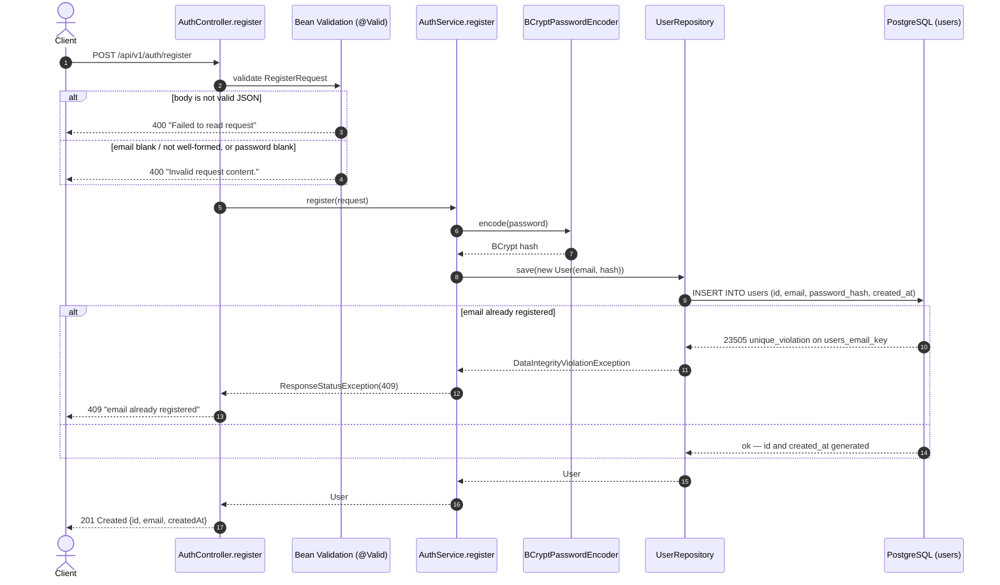

[← Back to docs index](../TUTORIAL.md)

# Flow: Register (`POST /api/v1/auth/register`)

Creates a new user account. Public endpoint — no auth required.

---

## 1. Contract

- **Method & path**: `POST /api/v1/auth/register`
- **Auth**: none
- **Rate limit**: none yet — `memory/auth.md` calls for one keyed `client_ip`, tracked as plan
  task [1.8.4.2](../../.claude/docs/plans/auth.md), not implemented
- **Request / response**: JSON

### Request

```json
{
  "email": "learner@example.com",
  "password": "correcthorsebattery"
}
```

### Response — `201 Created`

```json
{
  "id": "0feea416-035a-439b-beac-8719d9db289c",
  "email": "learner@example.com",
  "createdAt": "2026-09-22T03:32:43.641002Z"
}
```

`id` is a random UUID, generated in the JVM by Hibernate (`GenerationType.UUID`), not read back
from the database's own `gen_random_uuid()` default. The password hash is never returned —
`RegisterResponse` simply has no field for it.

---

## 2. Sequence



---

## 3. Step by step

1. **Deserialize + validate.** `@Valid @RequestBody RegisterRequest` — `email` must be non-blank and
   a well-formed address (`@Email`), `password` must be non-blank (`@NotBlank`). Malformed JSON and
   failed validation both surface as Spring's default `400` `ProblemDetail`, not a custom error
   shape — see § 4 for the exact bodies.
2. **No email normalization.** Unlike a case-insensitive lookup, the `email` column's `UNIQUE`
   constraint is case-sensitive as stored — `A@x.com` and `a@x.com` are two different rows today.
   No lower-casing/trimming happens in `RegisterRequest` or `AuthService`.
3. **No password policy beyond non-blank.** `memory/auth.md` states none, so none is enforced —
   deliberately not inventing a length/complexity rule the spec doesn't name.
4. **Hash the password.** `BCryptPasswordEncoder` (default strength, cost 10) — bcrypt generates
   its own salt and embeds it in the hash string, so there's nothing extra to store.
5. **No pre-check for duplicates.** `AuthService.register` goes straight to `save()` and lets the
   `users.email` `UNIQUE` constraint (`V2__users.sql`) do the work — a check-then-insert would race
   two concurrent registrations for the same email; the constraint is what actually makes that race
   impossible to both succeed.
6. **Catch and translate.** A `DataIntegrityViolationException` from that constraint is caught and
   rethrown as `ResponseStatusException(HttpStatus.CONFLICT, "email already registered")`. Spring's
   `problemdetails` support (`spring.mvc.problemdetails.enabled: true`) renders it as RFC 9457
   automatically — no custom exception type or `@ControllerAdvice`.
7. **Respond.** `id`, `email`, `createdAt` only. Registration does not log the user in — there is no
   login endpoint yet (plan task 1.1.5).

---

## 4. Errors

Bodies below are the real responses (`curl`), not invented — Spring's default `ProblemDetail` for
validation/media-type errors is generic (`"Invalid request content."`), it does not list which
field failed.

| Condition | Status | `detail` |
|---|:---:|---|
| Body is not valid JSON | `400` | `Failed to read request` |
| `email` blank/not a valid address, or `password` blank | `400` | `Invalid request content.` |
| `Content-Type` isn't `application/json` | `415` | `Content-Type '...' is not supported.` |
| Email already registered | `409` | `email already registered` |
